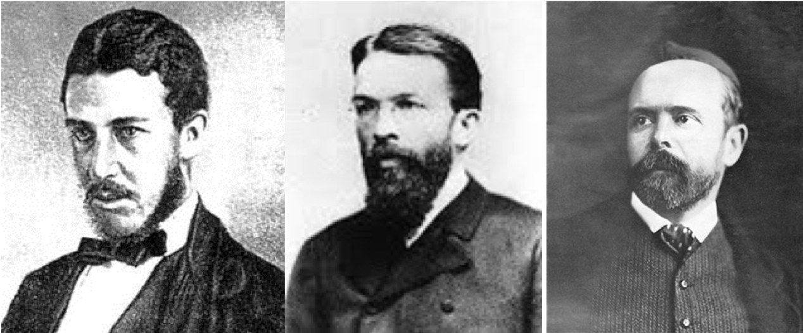
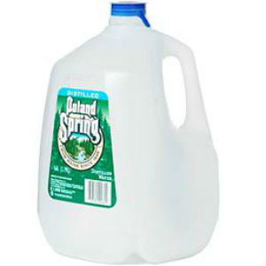

```{r setup, include=FALSE}
options(htmltools.dir.version = FALSE)
knitr::opts_chunk$set(echo=F,
                      message=F,
                      warning=F)
```

class: inverse, center, middle

# The Logic of Choice

---

# The Logic of Choice: Ends and Means

.pull-left[
- Each of us acts .hi-purple[purposefully]

- We have .hi[ends], goals, desires, objectives, etc

- We use .hi[means] in the world that we believe will achieve our ends

]

.pull-right[


]

---

# The Logic of Choice: Purpose

.pull-left[

- Acting with .hi-purple[purpose] distinguishes humans from everything else in the universe

- Artificial intelligence researchers face .hi-turquoise["the frame problem"]
    - We thought: computation is hard, perception is easy
    - We've found: computation is easy, perception is hard!

]

.pull-right[

.center[

]
]

---

# Causal Inference I

.pull-left[
- Machine learning and artificial intelligence are "dumb"<sup>1</sup>
- With the right models and research designs, we *can* say "X causes Y" and quantify it!
- Economists are in a unique position to make *causal* claims that mere statistics cannot
]

.pull-right[

]

.footnote[<sup>1</sup> For more, see [my blog post](https://ryansafner.com/post/econometrics-data-science-and-causal-inference/), and Pearl & MacKenzie (2018), *The Book of Why*]
---

# Causal Inference II

.pull-left[
.center[

[Harvard Business Review](https://hbr.org/2019/02/why-tech-companies-hire-so-many-economists)
]
]
.pull-right[

.smallest[
"First, the field of economics has spent decades developing a toolkit aimed at investigating empirical relationships, focusing on techniques to help understand which correlations speak to a causal relationship and which do not. This comes up all the time — does Uber Express Pool grow the full Uber user base, or simply draw in users from other Uber products? Should eBay advertise on Google, or does this simply syphon off people who would have come through organic search anyway? Are African-American Airbnb users rejected on the basis of their race? These are just a few of the countless questions that tech companies are grappling with, investing heavily in understanding the extent of a causal relationship."
]
]

---

# Methodological Individualism

.pull-left[

- .hi-purple[Only individual people act]

- The individual is the base unit of all economic analysis

- *"How will action/choice/policy/institution [X] affect each individual's well-being?"*
]

.pull-right[

.center[

]
]

---

# Goods and Services

.pull-left[

- Actions that satisfy human desires provide a .hi[service]

- An object that can provide services is called an .hi[economic good] or a .hi[resource]

]

.pull-right[
.center[


]

]

---

# Consumption

.pull-left[

- Goods and services provide ".hi[utility]" (satisfaction of a desire) when we .hi[consume] them 

]

.pull-right[
.center[

]
]

---

# Bads

.pull-left[

- An .hi[economic bad] is something that hinders our ability to satisfy our desires

]

.pull-right[
.center[


]
]

---

class: inverse, center, middle

# Scarcity and Its Economic Implications

---

# Scarcity

.pull-left[

- .hi[Scarcity]: human desires are practically unlimited, but our ability to satisfy them (with goods and services) is limited

- How do we best *economize* limited resources to satisfy our unlimited desires "*efficiently*?"

]

.pull-right[

.center[

]
]

---

# Choice

.pull-left[

- We can only pursue one goal at a time

- This implies that we must .hi-purple[choose] to forgo all other alternatives when we pursue each goal

]

.pull-right[

.center[

]
]

---

# Choice $\rightarrow$ Opportunity Cost

.pull-left[

- We can only pursue one goal at a time

- This implies that we must .hi-purple[choose] to forgo all other alternatives when we pursue each goal

- The .hi[(opportunity) cost] of every choice is the next best alternative given up
    - "You can't have your cake and eat it too"
]

.pull-right[

.center[

]
]

---

# The Parable of the Broken Window

.left-column[
.center[


Frederic Bastiat

1801-1850
]
]

.right-column[

- *That Which is Seen and That Which is Not Seen*

]

---

# The Parable of the Broken Window

.left-column[
.center[


Frederic Bastiat

1801-1850
]
]

.right-column[

- *That Which is Seen and That Which is Not Seen*

- "That which is seen"
    - The broken window
    - Resources diverted into glassmaking
]

---

# The Parable of the Broken Window

.left-column[
.center[


Frederic Bastiat

1801-1850
]
]

.right-column[

- *That Which is Seen and That Which is Not Seen*

- "That which is seen"
    - The broken window
    - Resources diverted into glassmaking

- "That which is not seen"
    - Opportunity cost of fixing the window
    - Resources diverted *away* from other opportunities
]

---

# Applying the Parable of the Broken Window

.pull-left[

- What does it mean to say that **"spending money 'stimulates' the economy"?**

]

.pull-right[

.center[

]
]

---

# Applying the Parable of the Broken Window

.pull-left[

- What does it mean to say that **"spending money 'stimulates' the economy"?** 

- Scarce resources used in one industry can **not** be used in other industries

- .hi-purple[Every (visible) decision to spend on X yields more X, and destroys an (invisible) opportunity to spend on Y]

]

.pull-right[

.center[

]
]

---

class: inverse, middle, center

# Where Do Goods Get Their Value? 

---

# A Theory of Value

.pull-left[

- .hi-purple["Classical Economists" (c. 1776-1870)]

- Goods have "*natural*" prices, determined *objectively* by cost of production (wages+rents+profits)
    - *Labor* theory of value: prices of goods determined by amount of "labor hours" to make

]

.pull-right[

.center[

]
]

---

# A Paradox!

.center[

]

---

# The Solution (1870s)

.center[

]

---

# The Marginalist Revolution

.pull-left[
- All human choices are made .hi-purple["on the margin], considering a small change from your current situation

- Buying, selling, consuming, or producing .hi-purple[a discrete unit] of a particular good at a time

- Each unit of a good consumed provides .hi[marginal utility]

]

.pull-right[

.center[

]
]

---

# Marginalism

.left-column[

.center[


Carl Menger

1840-1921
]
]

.right-column[

> Value is thus nothing inherent in goods, no property of them, nor an independent thing existing by itself. It is a judgment economizing men make about the importance of the goods at their disposal for the maintenance of their lives and well-being. Hence, value does not exist outside the consciousness of men (pp. 120-121).

]

.source[Menger, Carl, 1871, *Principles of Economics*]

---

# Marginal Utility Determines Prices: A Demonstration

.center[

]

---

# Three Insights About Value

.pull-left[

- Value is .hi-purple[subjective]
  - Each of us has our own preferences that determine our ends or objectives
  - Choice is .hi-turquoise[forward looking]: a comparison of your .hi-turquoise[expectations] about opportunities
  
- .hi[Preferences are not comparable across individuals]
  - Only individuals know what they give up at the moment of choice
]

.pull-right[
.center[

]
]

---

# Three Insights About Value

.pull-left[

- Value is measured as an .hi-purple[ordinal] concept 
    - We can *rank* our objectives relative to each other (but cannot quantify further)
    - We pursue highest-valued objectives (highest marginal utility) first
    - Pursuing one objective means *not* pursuing others!
]

.pull-right[
.center[

]
]

---

# Three Insights About Value

.pull-left[

- Value inherently comes from the fact that we must make .hi-purple[tradeoffs]
    - Making one choice means *having to give up* pursuing others!
    - The choice we pursue at the moment must be worth the sacrifice of others! (i.e. highest marginal utility)
]

.pull-right[
.center[

]
]

---

# Value and the Margin I

.pull-left[

.hi-purple[The Law of Diminishing Marginal Utility]: each marginal unit of a good consumed tends to provide less marginal utility than the previous unit, all else equal
]

.pull-right[

.center[

]
]

---

# Value and the Margin II

.pull-left[
.hi-green[Example:] Suppose you have 5 uses for water by their value to you. Assume each use requires exactly 1 gallon of water:

1. Drink water
2. Take a shower
3. Wash car
4. Water plants 
5. Change goldfish's water

]

.pull-right[
.center[

]
]

---

# Value and the Margin II

.pull-left[
.hi-green[**Example**:] Suppose you have 5 uses for water by their value to you. Assume each use requires exactly 1 gallon of water:

1. Drink water
2. Take a shower
3. Wash car
4. Water plants 
5. Change goldfish's water

Suppose you have only **1** gallon of water, what will you do with it? 
]

.pull-right[
.center[

]
]

---

# Value and the Margin II

.pull-left[
.hi-green[Example:] Suppose you have 5 uses for water by their value to you. Assume each use requires exactly 1 gallon of water:

1. Drink water
2. Take a shower
3. Wash car
4. Water plants 
5. Change goldfish's water

Suppose you have have **2** gallons of water, what will you do with them? 
]


.pull-right[
.center[

]
]

---

# Value and the Margin II

.pull-left[
.hi-green[Example:] Suppose you have 5 uses for water by their value to you. Assume each use requires exactly 1 gallon of water:

1. Drink water
2. Take a shower
3. Wash car
4. Water plants 
5. Change goldfish's water

Suppose you had **5** gallons of water, but **spill one.** Which activity will you **stop** doing?
]

.pull-right[
.center[

]
]
