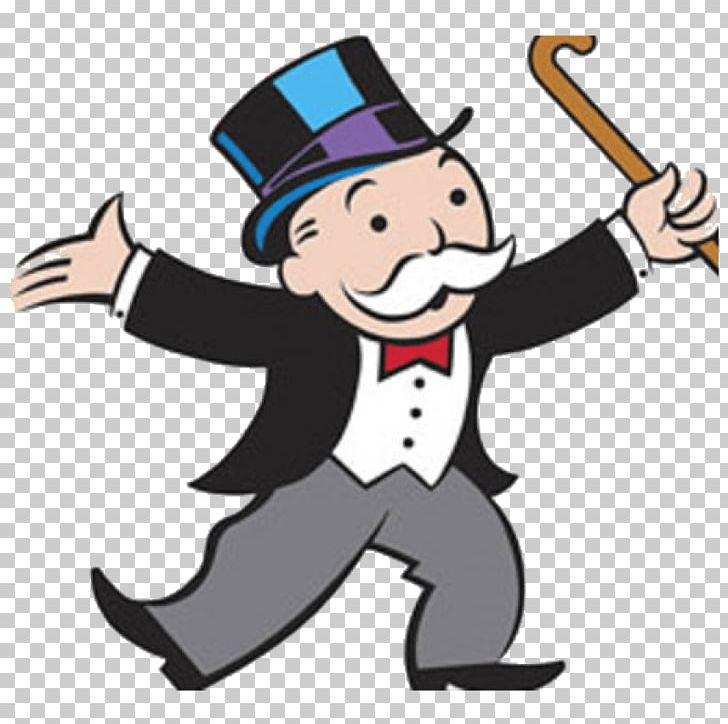
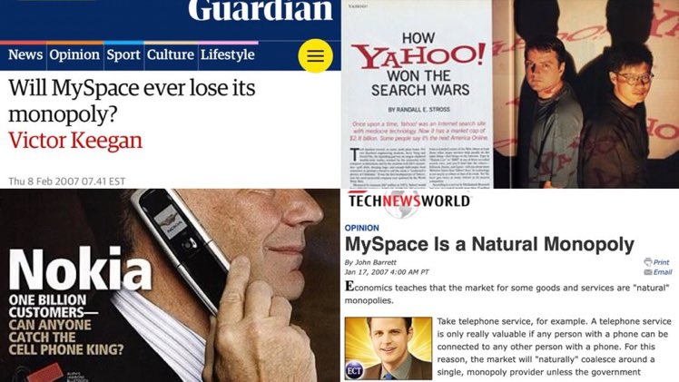
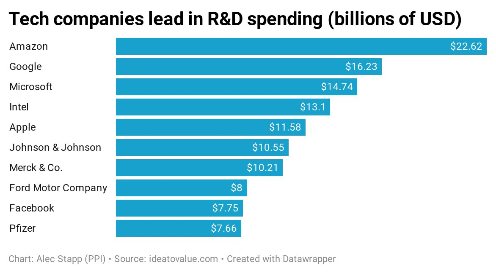
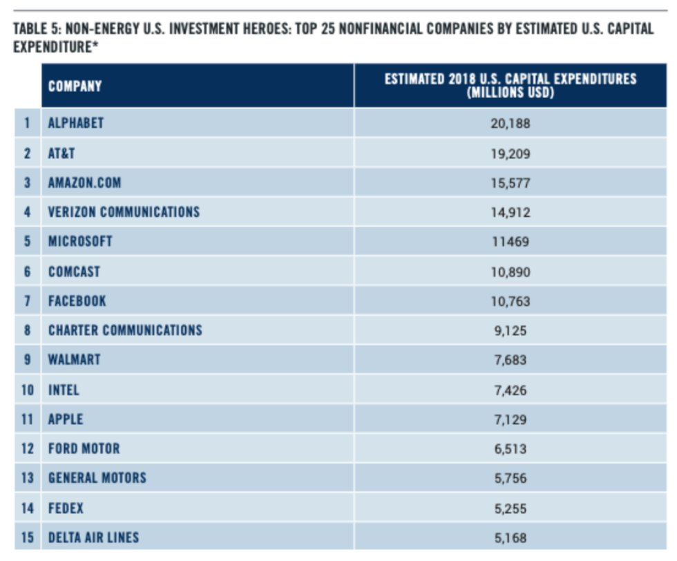
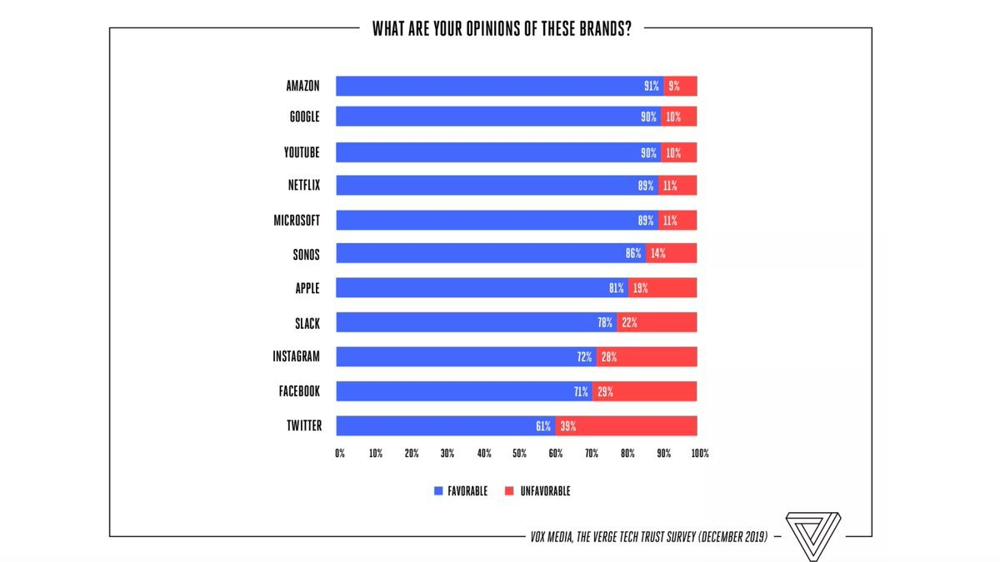

```{r setup, include=FALSE}
options(htmltools.dir.version = FALSE)
knitr::opts_chunk$set(echo=F,
                      message=F,
                      warning=F)
library("tidyverse")
library("mosaic")
library("ggrepel")
update_geom_defaults("label", list(family = "Fira Sans Condensed"))
set.seed(256)
```

class: inverse

# Outline

### [The Social Harm of Market Power](#)

### [What Is a Monopoly?](#)

### [What If You’re Just *Better*?](#)

### [The *Ugly* of Monopoly: Rent-Seeking](#)

---

# Monopoly: The Good, the Bad, and the Ugly

.pull-left[
.smallest[
- No market is perfectly competitive (it’s an extreme model); but that does not necessarily imply market failure

- Monopoly & market power are *interesting*
  - Most firms clearly have *some* market power
  - Market power $\neq$ bad, necessarily!

- Today, we’ll examine what I call “the good, the bad, and the ugly” of market power
  - but not necessarily in that order!
]
]

.pull-right[
.center[

]
]

---

class: inverse, center, middle

# The Social Harm of Market Power

---

# Perfectly Competitive Market

.pull-left[
```{r, fig.retina=3, fig.height=4.5}
demand<-function(x){10-x}
supply<-function(x){x}
demand_firm<-function(x){10}
mc_cc<-function(x){3*x^2-8*x+9}
ac_cc<-function(x){x^2-4*x+10+10/x}

ggplot(data.frame(x=c(0,10)), aes(x=x))+
  stat_function(fun=demand_firm, geom="line", size=2, color = "blue")+
  geom_label(aes(x=4.5,y=demand_firm(4.5)), color = "blue", label="Demand", size = 5)+
    stat_function(fun=mc_cc, geom="line", size=2, color = "red")+
  geom_label(aes(x=3.5,y=mc_cc(3.5)), color = "red", label="MC(q)", size = 5)+
    stat_function(fun=ac_cc, geom="line", size=2, color = "orange")+
  geom_label(aes(x=4.5,y=ac_cc(4.5)), color = "orange", label="MC(q)", size = 5)+
  geom_segment(x=2.8, xend=2.8, y=0, yend=10, size=1, linetype="dotted")+
    scale_x_continuous(breaks=NULL,
                     limits=c(0,5),
                     expand=expand_scale(mult=c(0,0.1)))+
  scale_y_continuous(breaks=NULL,
                     limits=c(0,20),
                     expand=expand_scale(mult=c(0,0.1)))+
  guides(fill=F)+
  labs(title = "Representative Firm",
       x = "Quantity",
       y = "Price")+
  theme_classic(base_family = "Fira Sans Condensed", base_size=20)
```
]

.pull-right[
```{r, fig.retina=3, fig.height=4.5}
cs_1<-tribble(
  ~x, ~y,
  0, 10,
  0, 5,
  5, 5
)
ps_1<-tribble(
  ~x, ~y,
  0, 0,
  0, 5,
  5, 5
)

ggplot(data.frame(x=c(0,10)), aes(x=x))+
  geom_polygon(data=cs_1, aes(x=x,y=y), fill="blue", alpha=0.5)+
  geom_polygon(data=ps_1, aes(x=x,y=y), fill="red", alpha=0.5)+
  stat_function(fun=demand, geom="line", size=2, color = "blue")+
    geom_label(aes(x=9,y=demand(9)), color = "blue", label="Demand", size = 5)+
  stat_function(fun=supply, geom="line", size=2, color = "red")+
    geom_label(aes(x=9,y=supply(9)), color = "red", label="Supply", size = 5)+
  geom_segment(x=5, xend=5, y=0, yend=5, size=1, linetype="dotted")+
  geom_segment(x=0, xend=5, y=5, yend=5, size=1, linetype="dotted")+
  
  # point A
  geom_point(x = 5, y = 5, size=3)+
  geom_text(x = 5, y = 5.5, label = "A", size=5)+
  
    scale_x_continuous(breaks=NULL,
                     limits=c(0,10),
                     expand=expand_scale(mult=c(0,0.1)))+
  scale_y_continuous(breaks=NULL,
                     limits=c(0,10),
                     expand=expand_scale(mult=c(0,0.1)))+
  guides(fill=F)+
  labs(title = "Industry",
       x = "Quantity",
       y = "Price")+
  theme_classic(base_family = "Fira Sans Condensed", base_size=20)
```
]

.smallest[
- In a .hi[competitive market] in .hi[long run equilibrium]:
  - .hi-purple[Economic profit] is driven to $0; resources (factors of production) optimally allocated
  - .hi-purple[Allocatively efficient]: $p=MC(q)$, maximized .blue[CS] $+$ .red[PS]
  - .hi-purple[Productively efficient]: $p=AC(q)_{min}$ (otherwise firms would enter/exit)
]
---

# The Bad of Monopoly: DWL I

.pull-left[

```{r, fig.retina=3}
library(mosaic)
mc<-function(x){2}
demand<-function(x){10-x}
mr<-function(x){10-2*x}

CS<-tibble(x=c(0,0,8),
           y=c(10,2,2))
#PS<-tibble(x=c(0,0,2),
#           y=c(10,2,2))

#line_colors <- c("Supply" = "red", "Demand" = "blue")
#surplus_colors <-c("Consumer" = "blue", "Producer" = "red")

ggplot(data.frame(x=c(0,10)), aes(x=x))+
  geom_polygon(data=CS, aes(x=x,y=y), fill="blue",alpha=0.5)+
  stat_function(fun=demand, geom="line", size=2, color = "blue")+
    geom_label(aes(x=9,y=demand(9)), color = "blue", label="Demand", size = 5)+
  stat_function(fun=mc, geom="line", size=2, color = "red")+
    geom_label(aes(x=6,y=mc(6)), color = "red", label=expression(MC(q)==AC(q)), size = 5)+
  geom_segment(x=8, xend=8, y=0, yend=2, size=1, linetype="dotted")+
  geom_label(aes(x=3, y= 5), label="CS", color="blue", size =5)+
    scale_x_continuous(breaks=c(0,8),
                       labels=c(0,expression(q[c])),
                     limits=c(0,10),
                     expand=expand_scale(mult=c(0,0.1)))+
  scale_y_continuous(breaks=c(0,2),
                     labels=c(0,expression(p[c])),
                     limits=c(0,10),
                     expand=expand_scale(mult=c(0,0.1)))+
  guides(fill=F)+
  labs(x = "Quantity",
       y = "Price")+
  theme_classic(base_family = "Fira Sans Condensed", base_size=16)
```

]

.pull-right[

- Consider a market with some simplified cost assumptions:
  - No fixed costs, constant variable costs
  - implies $\color{red}{MC(q)=AC(q)}$

- If this was a *competitive* market, firms would set $p_c=MC(q)$ and (collectively), industry would produce $q_c$
  - .blue[Consumer surplus] maximized
]

---

# The Bad of Monopoly: DWL II

.pull-left[

```{r, fig.retina=3}
mc<-function(x){2}
demand<-function(x){10-x}
mr<-function(x){10-2*x}

CS<-tibble(x=c(0,0,8),
           y=c(10,2,2))

CS_2<-tibble(x=c(0,0,4),
           y=c(10,6,6))
dwl<-tibble(x=c(4,4,8),
           y=c(6,2,2))
mr<-function(x){10-2*x}

#line_colors <- c("Supply" = "red", "Demand" = "blue")
#surplus_colors <-c("Consumer" = "blue", "Producer" = "red")

ggplot(data.frame(x=c(0,10)), aes(x=x))+
  
  # surpluses
  geom_polygon(data=CS_2, aes(x=x,y=y), fill="blue",alpha=0.5)+
  geom_rect(xmin=0,xmax=4,ymin=2,ymax=6,fill="green", alpha=0.25)+ #profit
  geom_polygon(data=dwl, aes(x=x,y=y), fill="black",alpha=0.5)+ #dwl
  
  # surplus labels
  geom_label(aes(x=1.5, y= 4), label="Profit", color="green", size =5)+
  geom_label(aes(x=1.5, y= 7.5), label="CS", color="blue", size =5)+
  geom_label(aes(x=5.5, y= 3.5), label="DWL", color="black", size =5)+
  
  # lines 
  stat_function(fun=demand, geom="line", size=2, color = "blue")+
    geom_label(aes(x=9,y=demand(9)), color = "blue", label="Demand", size = 5)+
  stat_function(fun=mr, geom="line", size=2, color = "purple")+
    geom_label(aes(x=4.5,y=mr(4.5)), color = "purple", label=expression(MR(q)), size = 5)+
  stat_function(fun=mc, geom="line", size=2, color = "red")+
    geom_label(aes(x=6,y=mc(6)), color = "red", label=expression(MC(q)==AC(q)), size = 5)+
  
  # optimal dots
  geom_segment(x=0, xend=4, y=6, yend=6, size=1, linetype="dotted")+
  geom_segment(x=8, xend=8, y=0, yend=2, size=1, linetype="dotted")+
  geom_segment(x=4, xend=4, y=0, yend=6, size=1, linetype="dotted")+
  
  #geom_point(x=4,y=6, size=3)+

  scale_x_continuous(breaks=c(0,4,8),
                       labels=c(0,expression(q[m]),expression(q[c])),
                     limits=c(0,10),
                     expand=expand_scale(mult=c(0,0.1)))+
  scale_y_continuous(breaks=c(0,2,6),
                       labels=c(0,expression(p[c]),expression(p[m])),
                     limits=c(0,10),
                     expand=expand_scale(mult=c(0,0.1)))+
  guides(fill=F)+
  labs(x = "Quantity",
       y = "Price")+
  theme_classic(base_family = "Fira Sans Condensed", base_size=16)

```

]

.pull-right[

- A **monopolist** faces the *entire* market demand and sets $(q_m,p_m)$:
  - Sets .purple[`\\(MR(q)\\)`] $=$ .red[`\\(MC(q)\\)`] at $q_m$
  - Raises price to .blue[maximum consumers are WTP (Demand)]: $p_m$

- .hi-purple[Restricts output and raises price], compared to competitive market

- Earns .hi-green[monopoly profits (`\\(p>AC\\)`)] 

- Loss of .hi-blue[consumer surplus]

]

---

# The Bad of Monopoly II

.pull-left[

```{r, fig.retina=3}
mc<-function(x){2}
demand<-function(x){10-x}
mr<-function(x){10-2*x}

CS<-tibble(x=c(0,0,8),
           y=c(10,2,2))

CS_2<-tibble(x=c(0,0,4),
           y=c(10,6,6))
dwl<-tibble(x=c(4,4,8),
           y=c(6,2,2))
mr<-function(x){10-2*x}

#line_colors <- c("Supply" = "red", "Demand" = "blue")
#surplus_colors <-c("Consumer" = "blue", "Producer" = "red")

ggplot(data.frame(x=c(0,10)), aes(x=x))+
  
  # surpluses
  geom_polygon(data=CS_2, aes(x=x,y=y), fill="blue",alpha=0.5)+
  geom_rect(xmin=0,xmax=4,ymin=2,ymax=6,fill="green", alpha=0.25)+ #profit
  geom_polygon(data=dwl, aes(x=x,y=y), fill="black",alpha=0.5)+ #dwl
  
  # surplus labels
  geom_label(aes(x=1.5, y= 4), label="Profit", color="green", size =5)+
  geom_label(aes(x=1.5, y= 7.5), label="CS", color="blue", size =5)+
  geom_label(aes(x=5.5, y= 3.5), label="DWL", color="black", size =5)+
  
  # lines 
  stat_function(fun=demand, geom="line", size=2, color = "blue")+
    geom_label(aes(x=9,y=demand(9)), color = "blue", label="Demand", size = 5)+
  stat_function(fun=mr, geom="line", size=2, color = "purple")+
    geom_label(aes(x=4.5,y=mr(4.5)), color = "purple", label=expression(MR(q)), size = 5)+
  stat_function(fun=mc, geom="line", size=2, color = "red")+
    geom_label(aes(x=6,y=mc(6)), color = "red", label=expression(MC(q)==AC(q)), size = 5)+
  
  # optimal dots
  geom_segment(x=0, xend=4, y=6, yend=6, size=1, linetype="dotted")+
  geom_segment(x=8, xend=8, y=0, yend=2, size=1, linetype="dotted")+
  geom_segment(x=4, xend=4, y=0, yend=6, size=1, linetype="dotted")+
  
  scale_x_continuous(breaks=c(0,4,8),
                       labels=c(0,expression(q[m]),expression(q[c])),
                     limits=c(0,10),
                     expand=expand_scale(mult=c(0,0.1)))+
  scale_y_continuous(breaks=c(0,2,6),
                       labels=c(0,expression(p[c]),expression(p[m])),
                     limits=c(0,10),
                     expand=expand_scale(mult=c(0,0.1)))+
  guides(fill=F)+
  labs(x = "Quantity",
       y = "Price")+
  theme_classic(base_family = "Fira Sans Condensed", base_size=16)

```

]

.pull-right[

- **Deadweight loss** of surplus destroyed from lost gains from trade
  - Consumers willing to buy more than $q_m$, if the monopolist would lower prices!
  - Monopolist *would* benefit by accepting lower prices to sell more, but this would yield *less* than maximum profits

]

---

# The Bad of Monopoly II

.pull-left[
.center[

]
]

.pull-right[

- **Deadweight loss** of surplus destroyed from lost gains from trade
  - Consumers willing to buy more than $q_m$, if the monopolist would lower prices!
  - Monopolist *would* benefit by accepting lower prices to sell more, but this would yield *less* than maximum profits

]

---

# The Bad of Monopoly: X-Inefficiency

.pull-left[

```{r, fig.retina=3}
mc<-function(x){2}
mc_x<-function(x){4}
dwl_x<-tibble(x=c(6,6,8),
           y=c(4,2,2))


ggplot(data.frame(x=c(0,10)), aes(x=x))+
  
  # surpluses
  #geom_rect(xmin=0,xmax=6,ymin=2,ymax=4,fill="black", alpha=0.5)+ #profit
  #geom_polygon(data=dwl_x, aes(x=x,y=y), fill="black",alpha=0.5)+ #dwl
  
  # surplus labels
  #geom_label(aes(x=5.5, y= 3.5), label="DWL", color="black", size =5)+
  
  # lines 
  stat_function(fun=demand, geom="line", size=2, color = "blue")+
    geom_label(aes(x=9,y=demand(9)), color = "blue", label="Demand", size = 5)+
  stat_function(fun=mr, geom="line", size=2, color = "purple")+
    geom_label(aes(x=4.5,y=mr(4.5)), color = "purple", label=expression(MR(q)), size = 5)+
  stat_function(fun=mc, geom="line", size=2, color = "red")+
    geom_label(aes(x=6,y=mc(6)), color = "red", label=expression(MC(q)==AC(q)), size = 5)+
  stat_function(fun=mc_x, geom="line", size=2, color = "orange")+
    geom_label(aes(x=6,y=mc_x(6)), color = "orange", label=expression(MC(q)^{x}==AC(q)^{x}), size = 5)+
  # optimal dots
  geom_segment(x=0, xend=4, y=6, yend=6, size=1, linetype="dotted")+
  geom_segment(x=8, xend=8, y=0, yend=2, size=1, linetype="dotted")+
  geom_segment(x=4, xend=4, y=0, yend=6, size=1, linetype="dotted")+
  
  # x-eff
  geom_segment(x=3, xend=3, y=0, yend=7, size=1, linetype="dotted")+
  geom_segment(x=0, xend=3, y=7, yend=7, size=1, linetype="dotted")+
    scale_x_continuous(breaks=c(3,4,8),
                       labels=c(expression(q[m]^{x}),expression(q[m]),expression(q[c])),
                     limits=c(0,10),
                     expand=expand_scale(mult=c(0,0.1)))+
  scale_y_continuous(breaks=c(2,6,7),
                       labels=c(expression(p[c]),expression(p[m]),expression(p[m]^{x})),
                     limits=c(0,10),
                     expand=expand_scale(mult=c(0,0.1)))+
  guides(fill=F)+
  labs(x = "Quantity",
       y = "Price")+
  theme_classic(base_family = "Fira Sans Condensed", base_size=16)

```

]

.pull-right[

> “The best of all monopoly profits is a quiet life” - Sir John Hicks


- Monopoly may generate .hi[“X-inefficiency”]

- Lack of competition causes monopoly to be **complacent** or **lazy**
  - May inefficiently .orange[raise costs] of production

- Creates further distortions (lost surpluses)

]

---

# In General

.center[

]

---

class: inverse, center, middle

# What Is a Monopoly?

---

# What Is a Monopoly?

.pull-left[

- Everyone (economists & the public alike) generally agree that monopoly is bad

- But what *is* a monopoly?

- A surprisingly difficult question to answer!
]

.pull-right[
.center[

]
]

---

# In Ye Olde Days

.left-column[
.center[


Lord Edward Coke

1552--1634

Chief Justice (King's Bench)

]
]

.right-column[

> “A monopoly is an institution or allowance by the king, by his grant, commission, or otherwise...to any person or persons, bodies politic or corporate, for the sole buying, selling, making, working, or using of anything, whereby any person or persons, bodies politic or corporate, are sought to be restrained of any freedom or liberty that they had before, or hindered in their lawful trade,” (181).

.source[Coke, Edward, 1648, *Institutes of the laws of England*, Part 3]
]

---

# In Ye Olde Days

> "[A man lives] in a house built with monopoly bricks, with windows...of monopoly glass; heated by monopoly coal (in Ireland monopoly timber), burning in a grate made of monopoly iron...He washed himself in monopoly soap, his clothes in monopoly starch. He dressed in monopoly lace, monopoly linen, monopoly leather, monopoly gold thread...His clothes were dyed with monopoly dyes. He ate monopoly butter, monopoly currants, monopoly red herrings, monopoly salmon, and monopoly lobsters. His food was seasoned with monopoly salt, monopoly pepper, monopoly vinegar...He wrote with monopoly pens, on monopoly writing paper; read (through monopoly spectacles, by the light of monopoly candles) monopoly printed books," (quoted in Acemoglu and Robinson 2011, pp.187-188).

.source[Hill, Christopher, (1961), *The Century of Revolution*

Acemoglu, Daron and James A Robinson, 2013, *Why Nations Fail*]

---

# Isn’t a Single Seller a Monopolist?

.pull-left[
.smallest[
- Isn’t the only seller of something a monopolist?
  - A new inventor?
  - An artist?
  - LeBron James?
  - First-mover?

- Is the only hardware store in town a monopoly? Seafood restaurant?

]
]

.pull-right[
.center[

]
]

---

# Markets as an Evolutionary Process

.left-column[
.center[


Joseph Schumpeter

1883-1950
]
]

.right-column[
.smallest[
> "Capitalism...is by nature a form of economic change and not only never is but never can be stationary...The essential point to grasp is that in dealing with capitalism we are dealing with an .hi[evolutionary process.]," (pp.82). 

> "[I]n capitalist reality as distinguished from its textbook picture, it is not that kind of competition which counts but the competition from the new commodity, the new technology, the new source of supply, the new type of organization....hi[competition] which commands a decisive cost or quality advantage .hi[which strikes not at the margins of the profits and the outputs of the existing firms but at their foundations and their very lives.]" (p.132).

]

.source[Schumpeter, Joseph A, (1947), *Capitalism, Socialism, and Democracy*]
]
---

# Creative Destruction

.left-column[
.center[


Joseph Schumpeter

1883-1950
]
]

.right-column[

> "Industrial mutation--if I may use that biological term—that .hi[incessantly revolutionizes the economic structure from within], incessantly destroying the old one, incessantly creating a new one.  This .hi[process of Creative Destruction is the essential fact about capitalism].  It is what capitalism consists in and what every capitalist concern has got to live in" (p.83).

]

.source[Schumpeter, Joseph A, (1947), *Capitalism, Socialism, and Democracy*]

---

# Creative Destruction: Examples

.pull-left[
.center[

]
]
.pull-right[
.center[

]
]

---

# Creative Destruction: Example II

.center[

]

---

# Creative Destruction: Example III

.center[


59 years of progress
]

---

# No Corporate Monolith Lasts Forever (On Its Own)

.center[

]

---

# No Corporate Monolith Lasts Forever (On Its Own)

.center[

]

---

# No Corporate Monolith Lasts Forever (On Its Own)

.center[

]

---

# Monopoly *Persists* Because of Entry Barriers

.pull-left[

- Monopoly exists, and persists, because of .hi[barriers to entry]
  - otherwise, profits would get competed away by competitors

- Some might be natural, some might be good, some might be artificial or government-created
  - .hi-purple[“open”] vs. .hi-purple[“closed”] monopoly

- .hi-turquoise[How easy is it to enter and compete with existing firm?]

]

.pull-right[
.center[

]
]

---

# Monopoly Exists Because of Entry Barriers

.pull-left[
.quitesmall[
- Some possible types of entry barriers:
  - Control over key resource
  - Technological superiority
      - Name/brand recognition, high fixed/sunk costs, economies of scale, network externalities
  - Government regulation
      - Intellectual property rights, Occupational licensing, Public franchises ,Burdensome compliance ,Rent-seeking
]

.smallest[
- Which of these are “natural” vs. “artificial?”

- Which of these may be “good” vs. “bad?”
]
]

.pull-right[
.center[

]
]

---

# Control Over a Key Resource

.pull-left[
.center[


]
]

.pull-right[
.center[


]
]

.smallest[
- Aluminum Company of America (Alcoa) once controlled 90% of the market for bauxite (used to create aluminum), and produced 63% of world aluminum supply

- De Beers once owned 85% of the world's diamond supply

- Quite rare for a single firm to control key resources for long
]

---

class: inverse, center, middle

# What If You’re Just *Better*?

---

# Economies of Scale and Natural Monopoly I

.pull-left[

- Recall: .hi-purple[economies of scale]: as $\uparrow q$, $\downarrow AC(q)$

- .hi-purple[Minimum Efficient Scale (MES)]: $q$ with the lowest $AC(q)$

]

.pull-right[

```{r, fig.retina=3}
demand<-function(x){20-2*x}

mes_plot<-ggplot(data.frame(x=c(0,10)), aes(x=x))+
  stat_function(fun=demand, geom="line", size=2, color="blue")+
  geom_label(x = 9, y=demand(9), color = "blue", size = 5, label = "Demand")+
    scale_x_continuous(breaks=NULL,
                     limits=c(0,10),
                     expand=expand_scale(mult=c(0,0.1)))+
  scale_y_continuous(breaks=NULL,
                     limits=c(0,20),
                     expand=expand_scale(mult=c(0,0.1)))+
  labs(x = "Quantity",
       y = "Price")+
  theme_classic(base_family = "Fira Sans Condensed", base_size=20)+
  theme(legend.position = "bottom")
mes_plot
```
]

---

# Economies of Scale and Natural Monopoly I

.pull-left[

- Recall: .hi-purple[economies of scale]: as $\uparrow q$, $\downarrow AC(q)$

- .hi-purple[Minimum Efficient Scale (MES)]: $q$ with the lowest $AC(q)$

- If MES is small relative to market demand...
  - .orange[AC] hits .blue[Market demand] during **diseconomies of scale**...

]

.pull-right[

```{r, fig.retina=3}
tiny_mes<-function(x){(4*x-2)^(2)+12}

mes_plot+
  stat_function(fun=tiny_mes, geom="line", size=2, color="orange")+
  geom_segment(x=0, xend=4, y=12, yend=12, size=1, linetype="dashed")+
  geom_segment(x=4, xend=4, y=12, yend=0, size=1, linetype="dashed")+
  geom_label(x=2.5, y=12, label="MES (Competitive)", color="orange", size=5)
```
]

---

# Economies of Scale and Natural Monopoly I

.pull-left[

- Recall: .hi-purple[economies of scale]: as $\uparrow q$, $\downarrow AC(q)$

- .hi-purple[Minimum Efficient Scale (MES)]: $q$ with the lowest $AC(q)$

- If MES is small relative to market demand...
  - .orange[AC] hits .blue[Market demand] during **diseconomies of scale**...
  - .hi-purple[...can fit more identical firms into the industry!]

]

.pull-right[

```{r, fig.retina=3}
tiny_mes_2<-function(x){(4*x-4)^(2)+12}
tiny_mes_3<-function(x){(4*x-6)^(2)+12}
tiny_mes_4<-function(x){(4*x-8)^(2)+12}
tiny_mes_5<-function(x){(4*x-10)^(2)+12}
tiny_mes_6<-function(x){(4*x-12)^(2)+12}
tiny_mes_7<-function(x){(4*x-14)^(2)+12}
tiny_mes_8<-function(x){(4*x-16)^(2)+12}

mes_plot+
  stat_function(fun=tiny_mes, geom="line", size=2, color="orange")+
  stat_function(fun=tiny_mes_2, geom="line", size=2, color="orange")+
  stat_function(fun=tiny_mes_3, geom="line", size=2, color="orange")+
  stat_function(fun=tiny_mes_4, geom="line", size=2, color="orange")+
  stat_function(fun=tiny_mes_5, geom="line", size=2, color="orange")+
  stat_function(fun=tiny_mes_6, geom="line", size=2, color="orange")+
  stat_function(fun=tiny_mes_7, geom="line", size=2, color="orange")+
  stat_function(fun=tiny_mes_8, geom="line", size=2, color="orange")+
  geom_segment(x=0, xend=4, y=12, yend=12, size=1, linetype="dashed")+
  geom_segment(x=4, xend=4, y=12, yend=0, size=1, linetype="dashed")+
  geom_label(x=2.5, y=12, label="MES (Competitive)", color="orange", size=5)
```
]

---

# Economies of Scale and Natural Monopoly I

.pull-left[

- If MES is *large* relative to market demand...
  - .red[AC] hits .blue[Market demand] during **_economies_ of scale**...
  - .hi-purple[likely to be a single firm in the industry!]

]

.pull-right[

```{r, fig.retina=3}
big_mes<-function(x){(0.25*x-2)^(2)+4}

mes_plot+
  stat_function(fun=tiny_mes, geom="line", size=2, color="orange")+
  stat_function(fun=tiny_mes_2, geom="line", size=2, color="orange")+
  stat_function(fun=tiny_mes_3, geom="line", size=2, color="orange")+
  stat_function(fun=tiny_mes_4, geom="line", size=2, color="orange")+
  stat_function(fun=tiny_mes_5, geom="line", size=2, color="orange")+
  stat_function(fun=tiny_mes_6, geom="line", size=2, color="orange")+
  stat_function(fun=tiny_mes_7, geom="line", size=2, color="orange")+
  stat_function(fun=tiny_mes_8, geom="line", size=2, color="orange")+
  geom_segment(x=0, xend=4, y=12, yend=12, size=1, linetype="dashed")+
  geom_segment(x=4, xend=4, y=12, yend=0, size=1, linetype="dashed")+
  geom_label(x=2.5, y=12, label="MES (Competitive)", color="orange", size=5)+
  stat_function(fun=big_mes, geom="line", size=2, color="red")+
  geom_segment(x=0, xend=8, y=4, yend=4, size=1, linetype="dashed")+
  geom_segment(x=8, xend=8, y=4, yend=0, size=1, linetype="dashed")+
  geom_label(x=2.5, y=4, label="MES (Monopoly)", color="red", size=5)
```
]


---

# Economies of Scale and Natural Monopoly I

.pull-left[

- If MES is *large* relative to market demand...
  - .red[AC] hits .blue[Market demand] during **_economies_ of scale**...
  - .hi-purple[likely to be a single firm in the industry!]

- A .hi[natural monopoly] that can produce higher $q^*$ and lower $p^*$ than a competitive industry!

]

.pull-right[

```{r, fig.retina=3}
big_mes<-function(x){(0.25*x-2)^(2)+4}

mes_plot+
  stat_function(fun=tiny_mes, geom="line", size=2, color="orange")+
  stat_function(fun=tiny_mes_2, geom="line", size=2, color="orange")+
  stat_function(fun=tiny_mes_3, geom="line", size=2, color="orange")+
  stat_function(fun=tiny_mes_4, geom="line", size=2, color="orange")+
  stat_function(fun=tiny_mes_5, geom="line", size=2, color="orange")+
  stat_function(fun=tiny_mes_6, geom="line", size=2, color="orange")+
  stat_function(fun=tiny_mes_7, geom="line", size=2, color="orange")+
  stat_function(fun=tiny_mes_8, geom="line", size=2, color="orange")+
  geom_segment(x=0, xend=4, y=12, yend=12, size=1, linetype="dashed")+
  geom_segment(x=4, xend=4, y=12, yend=0, size=1, linetype="dashed")+
  geom_label(x=2.5, y=12, label="MES (Competitive)", color="orange", size=5)+
  stat_function(fun=big_mes, geom="line", size=2, color="red")+
  geom_segment(x=0, xend=8, y=4, yend=4, size=1, linetype="dashed")+
  geom_segment(x=8, xend=8, y=4, yend=0, size=1, linetype="dashed")+
  geom_label(x=2.5, y=4, label="MES (Monopoly)", color="red", size=5)
```
]

---

# Economies of Scale and Natural Monopoly II

.pull-left[
.content-box-green[
.green[**Example**]: Imagine a single isolated condo complex with 1,000 units far from any other buildings or telco infrastructure

- **Fixed costs**: laying cable to the complex is $100,000
- **Marginal costs**: connecting each unit: $0
]
]

.pull-right[

.center[

]
]

---

# Economies of Scale and Natural Monopoly II

.pull-left[
- Suppose .hi-purple[10 providers] split the complex, each laying down their own cables, and each serving 100 units:

$$\mathbf{\text{Average cost}}=\frac{\$100,000}{100}=\$1,000 \text{/subscriber}$$

]
.pull-right[

.center[

]
]

---

# Economies of Scale and Natural Monopoly II

.pull-left[

- Suppose .hi-purple[1 provider] serves the complex serving all 1,000 units:

$$\mathbf{\text{Average cost}}=\frac{\$100,000}{1000}=\$100 \text{/subscriber}$$

]
.pull-right[

.center[

]
]

---

# Regulating Natural Monopolies

.pull-left[

- Governments avoid "wasteful duplication" of competition, grant .hi-purple[exclusive franchises], a single monopolist allowed in geographic region

- Provider made a .hi-purple[common carrier]: monopolist must provide universal service to all

- .hi-purple[Rate of return regulation]: gov't and monopolist agree on a price to guarantee a "modest return on capital" (i.e. some $\pi>0)$
  - Attempting to $\uparrow q$ and $\downarrow p$
  - Prohibition on price discrimination, enforced subsidies 
]

.pull-right[
.center[

]
]

---

# Technological Superiority & Innovation

.pull-left[
.center[

]
]

.pull-left[
.center[

]

]

.quitesmall[
- Complacent monopolists would rather restrict output and raise profits to shareholders

- But big tech firms invest enormous amounts in capital & innovation! Worried about competition!

]

---

# Innovation

.pull-left[
.center[

]
]

.pull-right[

- Politicians may say one thing, but people like big tech companies, they provide an enormous amount of consumer surplus!
]

---

# Intellectual Property I

.pull-left[

.center[

]
]

.pull-right[
.center[

]
]

---

# Intellectual Property II

.pull-left[

.center[

]
]

--

.pull-right[
.center[


Source: [Washington Post (Sept 8, 2017)](https://www.washingtonpost.com/news/morning-mix/wp/2017/09/08/game-of-thrones-was-pirated-more-than-a-billion-times-far-more-than-it-was-watched-legally/)
]
]

---

# Intellectual Property III

.pull-left[

- For these economic reasons, .hi[patent] (for ideas and inventions) and .hi[copyright] (for expressions) laws exist

- Grant *temporary* monopoly to holder in order to recover their fixed costs and provide incentive to undertake (risky and expensive) research/creativity

- A utilitarian *tradeoff* between incentives and access

]

.pull-right[

.center[


]

]

---

# Intellectual Property IV

.pull-left[
.center[

]
]
.pull-right[
.center[

]
]

.center[
Source: [U.S. Patent 5,443,036 (1995)](http://www.google.com/patents/US5443036)

]

---

# Intellectual Property V

.pull-left[
.center[

]
]

.pull-right[
- [Apple, Inc. vs. Samsung Electronics Co., Ltd.](https://www.theverge.com/apple/2011/11/2/2533472/apple-vs-samsung)

- [Freakonomics: Apple vs. Samsung: Who Owns the Rectangle?](http://freakonomics.com/2012/08/03/apple-vs-samsung-who-owns-the-rectangle/)
]

---

class: inverse, center, middle

# The *Ugly* of Monopoly: Rent-Seeking

---

# Legal Prohibitions

.pull-left[

.center[

]
]

.pull-right[

- The United States Postal Service is the only provider of first class mail allowed by order of the government

- Starting another business that delivers mail is **illegal**

- Note: FedEx and UPS deliver *express packages*, can *not* deliver mail or use USPS mailboxes
]

---

# Taxis I

.pull-left[
.center[

]
]

.pull-right[


]

---

# Taxis II

.center[

]

---

# Taxis III

.pull-left[
.center[

]
]
.pull-right[
.center[

]

]

---

# Occupational Licensing I

.center[


In 1950, 1 in 20 jobs required a license. Today it's 1 in 4. Source: [Obama White House (2015): Occupational Licensing: A Framework for Policymakers](https://obamawhitehouse.archives.gov/sites/default/files/docs/licensing_report_final_nonembargo.pdf)
]

---

# Occupational Licensing II

.center[


Source: [Mercatus Research (March 25, 2014): Occupational Licensing: Bad for Competition, Bad for Low-Income Workers](https://www.mercatus.org/publication/occupational-licensing-bad-competition-bad-low-income-workers)
]

---

# Occupational Licensing III

.center[


]

---

# Occupational Licensing IV

.pull-left[
.center[

]
]

.pull-right[
.small[
> "'It is illegal in the state of Utah to do any form of extensions without a valid cosmetology license," the e-mail read. "Please delete your ad, or you will be reported.'

> To get a license, Jestina would have to spend more than a year in cosmetology school. Tuition would cost $16,000 dollars or more."

Source: [NPR Planet Money](https://www.npr.org/sections/money/2012/06/22/155596305/episode-381-why-its-illegal-to-braid-hair-without-a-license)
]

]

---

# The *Ugly* of Monopoly: Rent-Seeking I

.pull-left[

```{r, fig.retina=3}
mc<-function(x){2}
demand<-function(x){10-x}
mr<-function(x){10-2*x}

CS<-tibble(x=c(0,0,8),
           y=c(10,2,2))

CS_2<-tibble(x=c(0,0,4),
           y=c(10,6,6))
dwl<-tibble(x=c(4,4,8),
           y=c(6,2,2))
mr<-function(x){10-2*x}

#line_colors <- c("Supply" = "red", "Demand" = "blue")
#surplus_colors <-c("Consumer" = "blue", "Producer" = "red")

ggplot(data.frame(x=c(0,10)), aes(x=x))+
  
  # surpluses
  geom_polygon(data=CS_2, aes(x=x,y=y), fill="blue",alpha=0.5)+
  geom_rect(xmin=0,xmax=4,ymin=2,ymax=6,fill="green", alpha=0.25)+ #profit
  geom_polygon(data=dwl, aes(x=x,y=y), fill="black",alpha=0.5)+ #dwl
  
  # surplus labels
  geom_label(aes(x=1.5, y= 4), label="Profit", color="green", size =5)+
  geom_label(aes(x=1.5, y= 7.5), label="CS", color="blue", size =5)+
  geom_label(aes(x=5.5, y= 3.5), label="DWL", color="black", size =5)+
  
  # lines 
  stat_function(fun=demand, geom="line", size=2, color = "blue")+
    geom_label(aes(x=9,y=demand(9)), color = "blue", label="Demand", size = 5)+
  stat_function(fun=mr, geom="line", size=2, color = "purple")+
    geom_label(aes(x=4.5,y=mr(4.5)), color = "purple", label=expression(MR(q)), size = 5)+
  stat_function(fun=mc, geom="line", size=2, color = "red")+
    geom_label(aes(x=6,y=mc(6)), color = "red", label=expression(MC(q)==AC(q)), size = 5)+
  
  # optimal dots
  geom_segment(x=0, xend=4, y=6, yend=6, size=1, linetype="dotted")+
  geom_segment(x=8, xend=8, y=0, yend=2, size=1, linetype="dotted")+
  geom_segment(x=4, xend=4, y=0, yend=6, size=1, linetype="dotted")+
  
  scale_x_continuous(breaks=c(0,4,8),
                       labels=c(0,expression(q[m]),expression(q[c])),
                     limits=c(0,10),
                     expand=expand_scale(mult=c(0,0.1)))+
  scale_y_continuous(breaks=c(0,2,6),
                       labels=c(0,expression(p[c]),expression(p[m])),
                     limits=c(0,10),
                     expand=expand_scale(mult=c(0,0.1)))+
  guides(fill=F)+
  labs(x = "Quantity",
       y = "Price",
       caption = expression(paste("Demand: ", p(q)==10-q, ", Cost: ", C(q)==2*q)))+
  theme_classic(base_family = "Fira Sans Condensed", base_size=20)

```

]

.pull-right[

- The .hi-green[monopoly profits] earned with market power are an .hi[economic rent]
  - Comes from restricting entry & competition

- This is the “prize” of market power

]

---

# The *Ugly* of Monopoly: Rent-Seeking II

.pull-left[
.center[

]
]

.pull-right[

- Think of an .hi[economic rent] as a “prize,” the payment a person receives for a good above its opportunity cost

- Creating rents creates competition for the rents, causing people to invest resources in .hi[rent-seeking]

- The cost of the rent is not just the rent itself, but the resources invested in rent-seeking!
]

---

# Government Intervention Creates Rents I

.pull-left[
.center[

]
]

.pull-right[
.smaller[
- Political authorities intervene in markets in various ways that benefit some groups at the expense of everyone else
  - subsidies to groups (often producers)
  - regulation of industries
  - tariffs, quotas, and special exemptions from these
  - tax breaks and loopholes
  - conferring monopoly and other privileges

- See Mitchell (2013) in [today's readings](/reading/4.2-reading) for examples
]
]
---

# Government Intervention Creates Rents I

.pull-left[
.center[

]
]

.pull-right[
.smallest[
- These interventions create .hi[economic rents] for their beneficiaries by restricting competition

- This is a transfer of wealth from consumers/taxpayers to politically-favored groups

- The promise of earning a rent breeds **competition over the rents** (.hi[rent-seeking])
  - investments of resources to lobby political officials
]
]
---

# Rent-Seeking II

.left-column[
.center[


Gordon Tullock

1922-2014
]
]

.right-column[

> “The rectangle to the left of the [Deadweight loss] triangle is the income transfer that a successful monopolist can extort from the customers. **Surely we should expect that with a prize of this size dangling before our eyes, potential monopolists would be willing to invest large resources in the activity of monopolizing.** ... **Entrepreneurs should be willing to invest resources in attempts to form a monopoly** until the marginal cost equals the properly discounted return,” (p.231). 

]

.source[Tullock, Gordon, (1967), "The Welfare Cost of Tariffs, Monopolies, and Theft," *Western Economic Journal* 5(3): 224-232.]


---

# Milk?

.center[


Source: [*New York Times* (Feb 13, 2017)](https://www.nytimes.com/2017/02/13/well/eat/got-almond-milk-dairy-farms-protest-milk-label-on-nondairy-drinks.html)
]

---

# If You Look at the World Long Enough...

.center[

]

---

# Regulation has a Dark Side

.left-column[
.center[


George Stigler

1911-1991

Economics Nobel 1982
]
]

.right-column[

> "[A]s a rule, regulation is acquired by the industry and is designed and operated primarily for its benefits," (p.3).

]

.source[Stigler, George J, (1971), "The Theory of Economic Regulation," *Bell Journal of Economics and Management Science* 3:3-21]

---

class: inverse, center, middle

# Antitrust

---

# Antitrust and Competition Law I

.pull-left[

- Aren't monopolies illegal in the U.S.?

- **Yes**: engaging in anticompetitive practices in the U.S. is illegal under .hi[antitrust laws]
  - Laws intended to promote economic competition and reduce excessive market power
  - enforced by DOJ (criminal) and FTC (civil)

]

.pull-right[
.center[


]
]

---

# Antitrust and Competition Law II

.pull-left[

- Aren't monopolies illegal in the U.S.?

- **No**: most monopolies exist *because* of explicit or implicit government-backing
  - Some markets actually work *better* as a monopoly (**"the good"**, .hi-purple[natural monopoly], patents, etc.)
  - Some markets and regulators are .hi-purple[captured] via **rent-seeking** firms to block competition (**"the ugly"**)

]

.pull-right[
.center[


]
]

---

# Antitrust and Competition Law III

.pull-left[
.center[

]
]

.pull-right[

**Sherman Antitrust Act (1890)**
.smallest[
 > $\S$ 1: "Every contract, combination in the form of trust or otherwise, or conspiracy, in restraint of trade or commerce among the several States, or with foreign nations, is declared to be illegal." 

> $\S$ 2: "Every person who shall monopolize, or attempt to monopolize, or combine or conspire with any other person or persons, to monopolize any part of the trade or commerce among the several States, or with foreign nations, shall be deemed guilty of a felony [...]"
]

]

.source[26 Stat. 209, 15 U.S.C. $\S$ 1–7]

---

# Antitrust and Competition Law IV

.pull-left[
.center[


Source: [WSJ (Jan 23, 2017)](http://www.wsj.com/articles/federal-judge-blocks-aetna-humana-merger-on-antitrust-grounds-1485190239)
]
]

.pull-right[

- Mergers, acquisitions, and major corporate activities are scrutinized by DOJ and FTC on antitrust grounds
]

---

# Antitrust

.pull-left[
.center[

]
]

.pull-right[

- More about antitrust in my Industrial Organization course: (Classes [4.1-4.3](https://ios20.classes.ryansafner.com/))]