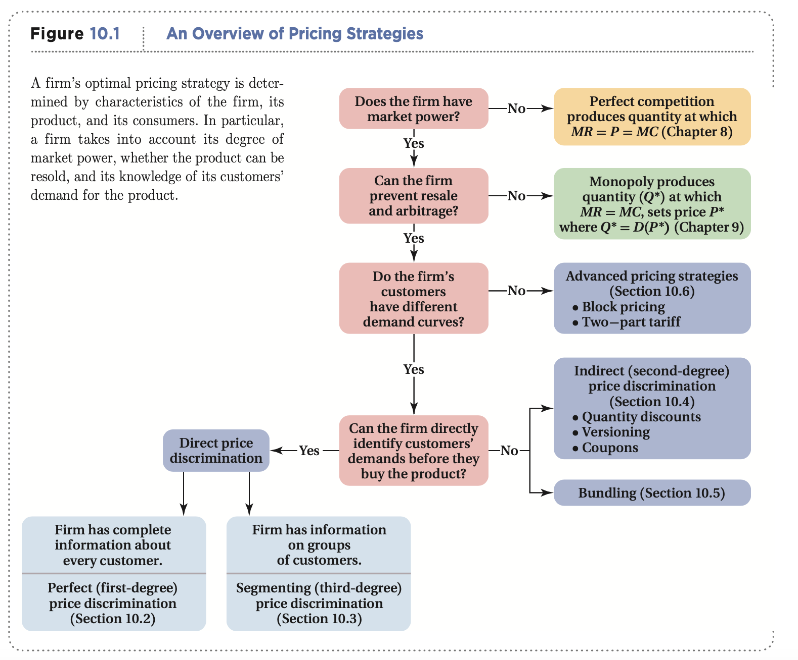
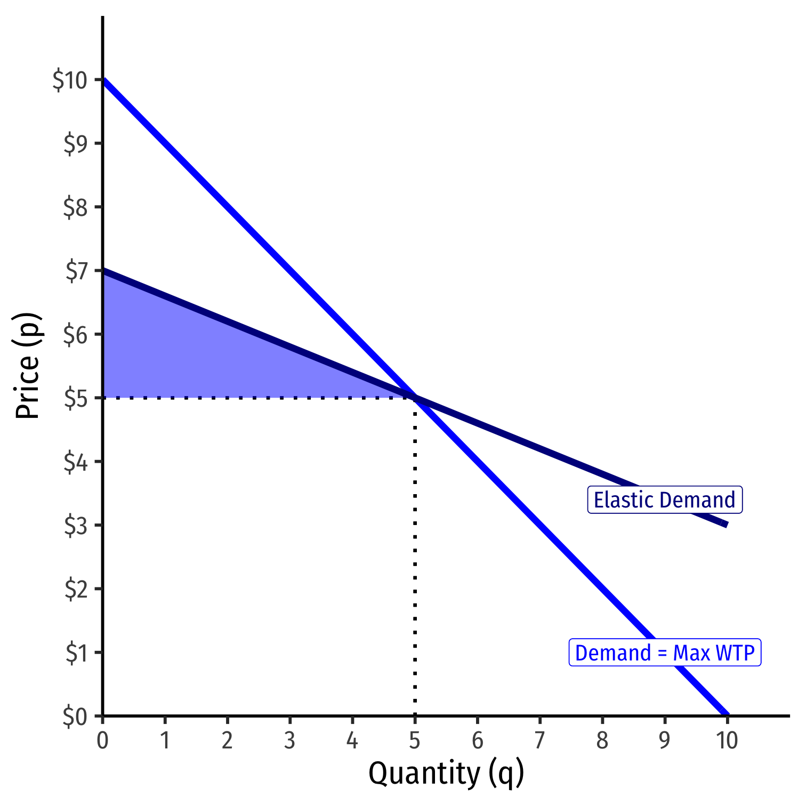
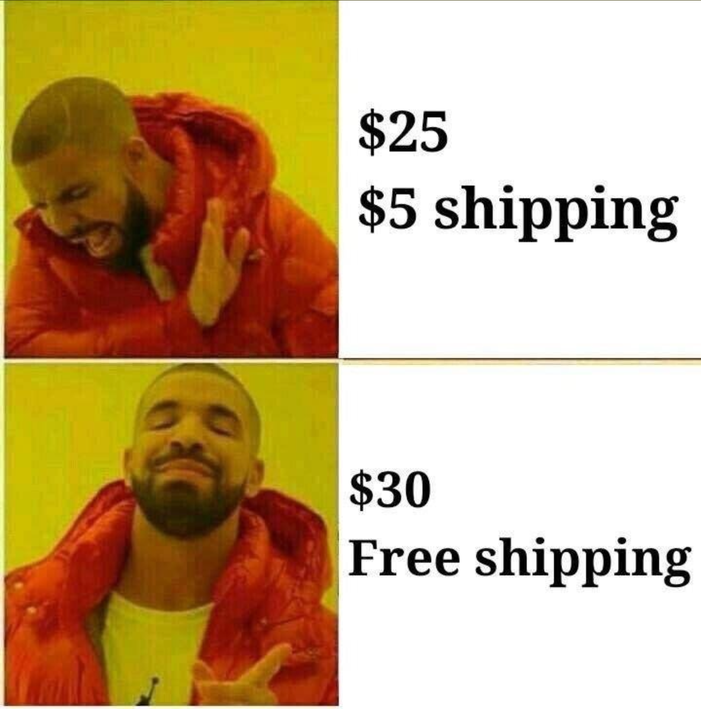
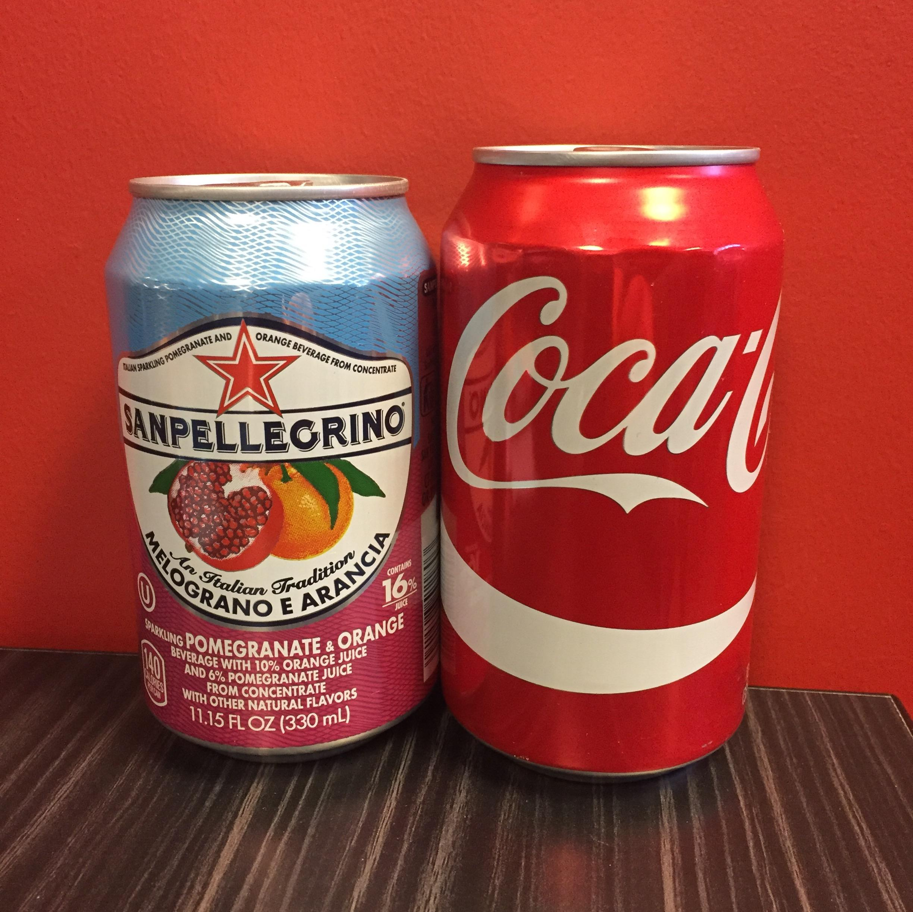

```{r setup, include=FALSE}
options(htmltools.dir.version = FALSE)
knitr::opts_chunk$set(echo=F,
                      message=F,
                      warning=F)
library("tidyverse")
library("mosaic")
library("ggrepel")
update_geom_defaults("label", list(family = "Fira Sans Condensed"))
set.seed(256)
```


class: inverse
# Outline

### [1<sup>st</sup>-Degree Price Discrimination](#14)

### [3<sup>rd</sup>-Degree Price Discrimination](#19)

### [2<sup>nd</sup>-Degree Price Discrimination](#34)

### [Is Price Discrimination Good or Bad?](#36)

### [Tying and Bundling](#47)

---

# Profit-Seeking Firms

.pull-left[

```{r, fig.retina=3}
library(mosaic)
mc<-function(x){2}
demand<-function(x){10-x}
mr<-function(x){10-2*x}

CS<-tibble(x=c(0,0,8),
           y=c(10,2,2))
#PS<-tibble(x=c(0,0,2),
#           y=c(10,2,2))

#line_colors <- c("Supply" = "red", "Demand" = "blue")
#surplus_colors <-c("Consumer" = "blue", "Producer" = "red")

comp<-ggplot(data.frame(x=c(0,10)), aes(x=x))+
  geom_polygon(data=CS, aes(x=x,y=y), fill="blue",alpha=0.5)+
  stat_function(fun=demand, geom="line", size=2, color = "blue")+
    geom_label(aes(x=9,y=demand(9)), color = "blue", label="Demand", size = 5)+
  stat_function(fun=mc, geom="line", size=2, color = "red")+
    geom_label(aes(x=6,y=mc(6)), color = "red", label=expression(MC(q)==AC(q)), size = 5)+
  geom_segment(x=8, xend=8, y=0, yend=2, size=1, linetype="dotted")+
  geom_label(aes(x=3, y= 5), label="CS", color="blue", size =5)+
    scale_x_continuous(breaks=c(0,8),
                       labels=c(0,expression(q[c])),
                     limits=c(0,10),
                     expand=expand_scale(mult=c(0,0.1)))+
  scale_y_continuous(breaks=c(0,2),
                     labels=c(0,expression(p[c])),
                     limits=c(0,10),
                     expand=expand_scale(mult=c(0,0.1)))+
  guides(fill=F)+
  labs(x = "Quantity",
       y = "Price")+
  theme_classic(base_family = "Fira Sans Condensed", base_size=16)
comp
```

]

.pull-right[

- Any firm with market power seeks to maximize profits

- Wants to (1<sup>st</sup>) **create** a surplus 

]

---

# Profit-Seeking Firms

.pull-left[

```{r, fig.retina=3}
CS_2<-tibble(x=c(0,0,4),
           y=c(10,6,6))
dwl<-tibble(x=c(4,4,8),
           y=c(6,2,2))
mr<-function(x){10-2*x}

#line_colors <- c("Supply" = "red", "Demand" = "blue")
#surplus_colors <-c("Consumer" = "blue", "Producer" = "red")

monopoly<-ggplot(data.frame(x=c(0,10)), aes(x=x))+
  
  # surpluses
  geom_polygon(data=CS_2, aes(x=x,y=y), fill="blue",alpha=0.5)+
  geom_rect(xmin=0,xmax=4,ymin=2,ymax=6,fill="green", alpha=0.25)+ #profit
  geom_polygon(data=dwl, aes(x=x,y=y), fill="black",alpha=0.5)+ #dwl
  
  # surplus labels
  geom_label(aes(x=1.5, y= 4), label="Profit", color="green", size =5)+
  geom_label(aes(x=1.5, y= 7.5), label="CS", color="blue", size =5)+
  geom_label(aes(x=5.5, y= 3.5), label="DWL", color="black", size =5)+
  
  # lines 
  stat_function(fun=demand, geom="line", size=2, color = "blue")+
    geom_label(aes(x=9,y=demand(9)), color = "blue", label="Demand", size = 5)+
  stat_function(fun=mr, geom="line", size=2, color = "purple")+
    geom_label(aes(x=4.5,y=mr(4.5)), color = "purple", label=expression(MR(q)), size = 5)+
  stat_function(fun=mc, geom="line", size=2, color = "red")+
    geom_label(aes(x=6,y=mc(6)), color = "red", label=expression(MC(q)==AC(q)), size = 5)+
  
  # optimal dots
  geom_segment(x=0, xend=4, y=6, yend=6, size=1, linetype="dotted")+
  geom_segment(x=8, xend=8, y=0, yend=2, size=1, linetype="dotted")+
  geom_segment(x=4, xend=4, y=0, yend=6, size=1, linetype="dotted")+
  
  #geom_point(x=4,y=6, size=3)+

  scale_x_continuous(breaks=c(0,4,8),
                       labels=c(0,expression(q[m]),expression(q[c])),
                     limits=c(0,10),
                     expand=expand_scale(mult=c(0,0.1)))+
  scale_y_continuous(breaks=c(0,2,6),
                       labels=c(0,expression(p[c]),expression(p[m])),
                     limits=c(0,10),
                     expand=expand_scale(mult=c(0,0.1)))+
  guides(fill=F)+
  labs(x = "Quantity",
       y = "Price")+
  theme_classic(base_family = "Fira Sans Condensed", base_size=16)
monopoly
```

]

.pull-right[

- Any firm with market power seeks to maximize profits

- Wants to (1<sup>st</sup>) **create** a surplus .hi-purple[and then *extract* some of it as profit]
  - i.e. convert .hi-blue[CS] $\rightarrow$ .hi-green[`\\(\pi\\)`]

- Consumers are *still* better off than without the firm because it creates value (.blue[consumer surplus])
  - Just not as *best*-off as under perfect competition

]

---

# Most Firms Create More Value than They Can Capture!

.left-column[

.center[

.smallest[
William Nordhaus

(1941-)

Economics Nobel 2018
]
]
]

.right-column[

> “We conclude that [about 2.2%] of the social returns from technological advances over the 1948-2001 period was captured by producers, indicating that most of the benefits of technological change are passed on to consumers rather than captured by producers,” (p.1)


]

.source[Nordhaus, William, 2004, ["Schumpeterian Profits in the American Economy: Theory and Measurement,"](https://www.nber.org/papers/w10433) *NBER Working Paper* 10433]

---

# Price Discrimination

.pull-left[

- The most obvious way to capture more surplus is to raise prices
  - But **Law of Demand** $\implies$ this would turn many customers away!

- Instead, if firm could charge **different** customers with *different WTP* **different** prices for **the same goods**, firm could convert more .blue[consumer surplus] into .green[profit]

- .hi[“Price discrimination”] or .hi[“Variable pricing”]

]

.pull-right[
.center[

]

]

---

# The Economics of Pricing Strategy I

.pull-left[

- Two conditions are required for a firm to engage in variable pricing:

.hi-purple[1) Firm must have market power]
  - A competitive firm must charge the market price
]

.pull-right[
.center[

]
]

---

# The Economics of Pricing Strategy I

.pull-left[

- Two conditions are required for a firm to engage in variable pricing:

.hi-purple[1) Firm must have market power]
  - A competitive firm must charge the market price

.hi-purple[2) Firms must be able to prevent resale or arbitrage]
  - Clever customers buy in your lower-price market to resell it in your higher-price market

]

.pull-right[
.center[


]
]

---

# The Economics of Pricing Strategy II

.pull-left[

- Firm *must acquire information* about the variations in its customers' demands

- Can the firm identify consumers' demands **before** they buy the product?


]

.pull-right[
.center[

]
]

---

# The Economics of Pricing Strategy III

.center[


(Goolsbee et al., 2013: 397)
]


---

# The Economics of Pricing Strategy IV

.pull-left[

- With **perfect information** $\implies$ .hi[Perfect] or .hi[1<sup>st</sup>-degree price discrimination]

- .hi-purple[Charge a different price to each customer] (their max WTP)

]

.pull-right[
.center[

]
]

---

# The Economics of Pricing Strategy V

.pull-left[

- With **imperfect information** $\implies$ .hi[3<sup>rd</sup>-degree price discrimination]

- Separate customers into groups (by demand differences) and charge each group a different price

]

.pull-right[
.center[

]
]

---

# The Economics of Pricing Strategy VI

.pull-left[

- .hi[2<sup>nd</sup>-degree price discrimination]: More **indirect** forms of pricing: tying, bundling, quantity-discounts
  - Firm does **not** have enough information to categorize customers into groups
  - Consumers **self-select** into their own group

]

.pull-right[
.center[

]
]

---

class: inverse, center, middle

# 1<sup>st</sup>-Degree Price Discrimination

---

# 1<sup>st</sup>-Degree Price Discrimination I

.pull-left[
.center[

]

]

.pull-right[

- If firm has *perfect information* about every customer's demand before purchase:

- .hi[Perfect] or .hi[1<sup>st</sup>-degree price discrimination]: firm charges *each* customer their maximum willingness to pay
  - “walks” down the market demand curve customer by customer

]

---

# 1<sup>st</sup>-Degree Price Discrimination II

.pull-left[

```{r, fig.retina=3}
library(mosaic)
mc<-function(x){2}
demand<-function(x){10-x}
mr<-function(x){10-2*x}

CS<-tibble(x=c(0,0,8),
           y=c(10,2,2))
#PS<-tibble(x=c(0,0,2),
#           y=c(10,2,2))

#line_colors <- c("Supply" = "red", "Demand" = "blue")
#surplus_colors <-c("Consumer" = "blue", "Producer" = "red")

perfectpd<-ggplot(data.frame(x=c(0,10)), aes(x=x))+
  geom_polygon(data=CS, aes(x=x,y=y), fill="green",alpha=0.5)+
  stat_function(fun=demand, geom="line", size=2, color = "blue")+
    geom_label(aes(x=9,y=demand(9)), color = "blue", label="Demand", size = 5)+
  stat_function(fun=mc, geom="line", size=2, color = "red")+
    geom_label(aes(x=6,y=mc(6)), color = "red", label=expression(MC(q)==AC(q)), size = 5)+
  geom_segment(x=8, xend=8, y=0, yend=2, size=1, linetype="dotted")+
  geom_label(aes(x=3, y= 5), label="Profit", color="green", size =5)+
  scale_x_continuous(breaks=c(0,4,8),
                       labels=c(0,expression(q[m]),expression(q[c])),
                     limits=c(0,10),
                     expand=expand_scale(mult=c(0,0.1)))+
  scale_y_continuous(breaks=c(0,2,6),
                       labels=c(0,expression(p[c]),expression(p[m])),
                     limits=c(0,10),
                     expand=expand_scale(mult=c(0,0.1)))+
  guides(fill=F)+
  labs(x = "Quantity",
       y = "Price")+
  theme_classic(base_family = "Fira Sans Condensed", base_size=20)
perfectpd
```

]

.pull-right[

- Firm converts *all* consumer surplus into profit!

- Produces the competitive amount $(q_c)$!

]

---

# 1<sup>st</sup>-Degree Price Discrimination: Example

.pull-left[
.center[

]
]

.pull-right[
.center[

]
]

---

# Big Data and Perfect Price Discrimination

.center[

]

---

class: inverse, center, middle

# 3<sup>rd</sup>-Degree Price Discrimination

---

# 3<sup>rd</sup>-Degree Price Discrimination I

.pull-left[

- Firms almost never have perfect information about their customers

- But they can often separate customers by .hi-purple[observable characteristics] into .hi-purple[different groups] with similar demands *before purchasing*

]

.pull-right[
.center[

]
]

---

# 3<sup>rd</sup>-Degree Price Discrimination I

.pull-left[

- Firms .hi[segment] the market or engage in .hi[3<sup>rd</sup>-degree price discrimination] by charging different prices to different *groups* of customers

- By far the most common type of price-discrimination
]

.pull-right[
.center[

]
]

---

# 3<sup>rd</sup>-Degree Price Discrimination II

.pull-left[

.center[
.smallest[
Business Travelers (Less Elastic)
]
]
```{r, fig.align="center", fig.height=5.5}
demand_i=function(x){10-2*x}
mr_i=function(x){10-4*x}

inelastic<-ggplot(data.frame(x=c(0,10)), aes(x=x))+
  stat_function(fun=demand_i, geom="line", size=2, color = "blue")+
  geom_label(aes(x=4.5, y=demand_i(4.5)), color="blue", label="Demand")+
  stat_function(fun=mr_i, geom="line", size=2, color = "purple")+
  geom_label(aes(x=2.25, y=mr_i(2.25)), color="purple", label="MR(q)")+
  stat_function(fun=mc, geom="line", size=2, color = "red")+
  geom_label(aes(x=8, y=mc(8)), color="red", label="MC(q)=AC(q)")+
    scale_x_continuous(breaks=NULL,
                     limits=c(0,10),
                     expand=expand_scale(mult=c(0,0.1)))+
  scale_y_continuous(breaks=NULL,
                     limits=c(0,10),
                     expand=expand_scale(mult=c(0,0.1)))+
  labs(x = "Tickets",
       y = "Price")+
  theme_classic(base_family = "Fira Sans Condensed", base_size=20)
inelastic
```
]

.pull-right[

.center[
.smallest[
Vacationers (More Elastic)
]
]

```{r, fig.align="center", fig.height=5.5}
demand_e=function(x){8-0.5*x}
mr_e=function(x){8-x}

elastic<-ggplot(data.frame(x=c(0,10)), aes(x=x))+
  stat_function(fun=demand_e, geom="line", size=2, color = "blue")+
  geom_label(aes(x=9, y=demand_e(9)), color="blue", label="Demand")+
  stat_function(fun=mr_e, geom="line", size=2, color = "purple")+
  geom_label(aes(x=7, y=mr_e(7)), color="purple", label="MR(q)")+
  stat_function(fun=mc, geom="line", size=2, color = "red")+
  geom_label(aes(x=8, y=mc(8)), color="red", label="MC(q)=AC(q)")+
    scale_x_continuous(breaks=NULL,
                     limits=c(0,10),
                     expand=expand_scale(mult=c(0,0.1)))+
  scale_y_continuous(breaks=NULL,
                     limits=c(0,10),
                     expand=expand_scale(mult=c(0,0.1)))+
  labs(x = "Tickets",
       y = "Price")+
  theme_classic(base_family = "Fira Sans Condensed", base_size=20)
elastic
```
]
.smallest[
Consider airlines: different groups of travelers have different demands & price elasticities
]
---

# 3<sup>rd</sup>-Degree Price Discrimination II

.pull-left[

.center[
.smallest[
Business Travelers (Less Elastic)
]
]
```{r, fig.align="center", fig.height=5.5}
inelastic+
  geom_segment(x=0, xend=2.25, y=5.5, yend=5.5, size =1 ,linetype= "dashed")+
  geom_segment(x=2.25, xend=2.25, y=5.5, yend=0, size =1 ,linetype= "dashed")+
  geom_rect(xmin=0,xmax=2.25,ymin=2,ymax=5.5, fill="green", alpha=0.5)
```
]

.pull-right[

.center[
.smallest[
Vacationers (More Elastic)
]
]
```{r, fig.align="center", fig.height=5.5}
elastic+
  geom_segment(x=0, xend=5, y=5.5, yend=5.5, size =1 ,linetype= "dashed")+
  geom_segment(x=5, xend=5, y=5.5, yend=0, size =1 ,linetype= "dashed")+
  geom_rect(xmin=0,xmax=5,ymin=2,ymax=5.5, fill="green", alpha=0.5)
```
]
.smallest[
The firm could charge a **single price** to all travelers and earn some .hi-green[profit]
]
---

# 3<sup>rd</sup>-Degree Price Discrimination II

.pull-left[

.center[
.smallest[
Business Travelers (Less Elastic)
]
]
```{r, fig.align="center", fig.height=5.5}
inelastic+
  geom_segment(x=0, xend=2.25, y=5.5, yend=5.5, size =1 ,linetype= "dashed")+
  geom_segment(x=2.25, xend=2.25, y=5.5, yend=0, size =1 ,linetype= "dashed")+
  geom_rect(xmin=0,xmax=2.25,ymin=2,ymax=5.5, fill="green", alpha=0.5)+
  geom_segment(x=0, xend=2, y=6, yend=6, size =1 ,linetype= "dashed")+
  geom_segment(x=2, xend=2, y=6, yend=0, size =1 ,linetype= "dashed")+
  geom_rect(xmin=0,xmax=2,ymin=2,ymax=6, fill="darkgreen", alpha=0.5)
```
]

.pull-right[

.center[
.smallest[
Vacationers (More Elastic)
]
]
```{r, fig.align="center", fig.height=5.5}
elastic+
  geom_segment(x=0, xend=5, y=5.5, yend=5.5, size =1 ,linetype= "dashed")+
  geom_segment(x=5, xend=5, y=5.5, yend=0, size =1 ,linetype= "dashed")+
  geom_rect(xmin=0,xmax=5,ymin=2,ymax=5.5, fill="green", alpha=0.5)+
  geom_segment(x=0, xend=6, y=5, yend=5, size =1 ,linetype= "dashed")+
  geom_segment(x=6, xend=6, y=5, yend=0, size =1 ,linetype= "dashed")+
  geom_rect(xmin=0,xmax=6,ymin=2,ymax=5, fill="darkgreen", alpha=0.5)
```
]

.smallest[
With **different prices**: raise price on inelastic travelers, lower price on elastic travelers, earn .hi-green[*more* profit]! 
]

---

# 3<sup>rd</sup>-Degree Price Discrimination: Examples I

.pull-left[
.center[

]
]

--

.pull-right[
.center[

]
]

---

# 3<sup>rd</sup>-Degree Price Discrimination: Examples II

.center[

]

---

# 3<sup>rd</sup>-Degree Price Discrimination: Examples III

.center[

]

---

# 3<sup>rd</sup>-Degree Price Discrimination: Examples IV

.pull-left[
.center[

]
]

--

.pull-right[
.center[

]
]

---

# Pricing and Markup

.pull-left[
.smallest[
- How much should each segment be charged?

- Firm treats each segment as a *different* market
  1. Find q*: $MR(q)=MC(q)$ 
  2. Raise p* to maximum WTP (Demand)

- Lerner index implies optimal markup for each segment, again:
$$\underbrace{\frac{p-MC(q)}{p}}_{\text{Markup % of Price}}=-\frac{1}{\epsilon}$$
]
]

.pull-right[
.center[

]
]
---

# 3<sup>rd</sup>-Degree Price Discrimination: Numerical Example

.content-box-green[
.green[**Example**]: Suppose you run a bar in downtown Frederick, and estimate the nightly demands for beer from undergraduates $(U)$ and graduates $(G)$ to be:

$$\begin{align*}
q_U&=18-4p_U\\
q_G&=12-p_G\\
\end{align*}$$

Assume the only cost of producing a beer is a constant marginal (and average) cost of $2.

]

1. If your bar could not price discriminate, how much profit would the bar earn?

2. If you could price discriminate, how much profit would the bar earn?

---

# Ways to Segment Markets

.pull-left[
- By customer characteristics
  - Age
  - Gender

- Past purchase behavior
  - repeat customers (more price sensitive)

- By location
  - local demand characteristics
]

.pull-right[
.center[

]
]
---

class: inverse, center, middle

# 2<sup>nd</sup>-Degree Price Discrimination

---

# 2<sup>nd</sup>-Degree Price Discrimination I

.pull-left[
.center[

]

]

.pull-right[

- If firm *cannot* identify customers' demands or types before purchase

- .hi[Indirect] or .hi[2<sup>nd</sup>-degree price discrimination]: firm offers difference price-quantity bundles and allows customers **self-select** their offer

- Ex: **quantity-discounts** or **block pricing**
  - Larger quantities offered at lower prices

]

---

class: inverse, center, middle

# Is Price Discrimination Good or Bad?

---

# Is Price Discrimination Good or Bad? I

.pull-left[

- Ideal competitive market, $q^*$ where $p^c=MC$
]

.pull-right[

```{r, fig.retina=3}
comp
```

]

---

# Is Price Discrimination Good or Bad? I

.pull-left[

- Ideal competitive market, $q^c$ where $p^c=MC$

- A pure monopolist would produce less $q^m$ at higher $p^m$
  - reduce .blue[consumer surplus] and create **deadweight loss**

- Transfer of some surplus from consumers to producers


]

.pull-right[

```{r, fig.retina=3}
monopoly
```

]


---

# Is Price Discrimination Good or Bad? I

.pull-left[

- A price-discriminating monopolist transfers MORE surplus from consumers to producers

- But encourages monopolist to produce more than the pure monopoly level and reduce deadweight loss!
  - At best, also produces at competitive output level! 
]

.pull-right[

```{r, fig.retina=3}
perfectpd
```

]

---

# Is Price Discrimination Good or Bad? II

.pull-left[

- Price-discrimination creates incentives for innovation and risk-taking

- Firms with high fixed costs of investment earn great profits, can recover their fixed costs

- Might not do so without ability to price-discriminate
]

.pull-right[
.center[

]
]

---

# Is Price Discrimination Good or Bad? III

.pull-left[

- As with markups in general, price discrimination has everything to do with .hi[price elasticity of demand]

- If you are paying too much and losing consumer surplus, the real "problem" is that .hi-purple[your demand is very inelastic]
  - fewer options, a particular brand, or a necessity, limited time, etc

- If you want to pay less, .hi-purple[buy generic] (more elastic)

]

.pull-right[
.center[

]
]

---

# How to Be a Savvy Consumer

.pull-left[
.smallest[
- Realize that any “sales” and “discounts” are calculate to make *the store* more money

- But it *can* make you better off as a consumer too if you are smart

- Think about your .blue[consumer surplus]!

- If you were *already* planning to buy the product, a fall in price is a good deal for you
  - Your demand is less elastic

- If you *weren’t* going to buy the product before, and now you do, the sale was effective for the store, and you likely don’t get much surplus
  - Your demand is more elastic

]
]

.pull-right[

]

---

# Behavioral Economics

.center[

]

---

# Price Discrimination vs. Price Differences

.pull-left[

- .hi[Price discrimination] is selling *identical* goods to people at different prices

- But not everytime people pay different prices means it is price discrimination

- Sometimes it is truly different goods that people are paying different prices for
  - If *costs* to firm are *different* for different versions (color, size, etc.), it is a *different* good, *not* price discrimination

]

.pull-right[
.center[

]

]

---

# Price Discrimination vs. Price Differences

.pull-left[

- .hi-green[Example]: bottled sparkling water often more expensive than Coca Cola
  - Could be because sparkling water drinkers have more elastic demand than Coke drinkers
  - Or could be that it is more expensive to package sparkling water (economies of scale with greater number of Coke drinkers)

]

.pull-right[
.center[

]

]

---

# Price Discrimination vs. Price Differences

.pull-left[

- The only way to tell the difference is to see what happens if demand changes price elasticity (and costs do not change)
  - Price discrimination requires market power, firm with market power marks up price based on $\frac{1}{\epsilon}$
  - Competitive firm only sets $p=MC$, so change in elasticity has no effect on price

- See [today’s class notes](/class/4.3-class) for a graphical demonstration
]

.pull-right[
.center[

]

]

---

class: inverse, center, middle

# Tying and Bundling

---

# Tying I

.pull-left[

- Firms often .hi[tie] multiple goods together, where you must buy both goods in order to consume the product
  - One good often the "base" and the other are "refills" that you may need to buy more of

- This is actually a method of .hi-purple[*intertemporal* price-discrimination]!

]

.pull-right[
.center[


]

]

---

# Tying II

.pull-left[

- Companies often **sell printers at marginal cost** (no markup) and sell the **ink/refills at a much higher markup**

- **Reduce arbitrage**:
  - printer requires specific ink
  - ink only words with that specific printer

]

.pull-right[

.center[

]
]

---

# Tying II

.pull-left[

- Segment the market into:

1. .hi-purple[High-volume users]: buy more ink over time; pay more per sheet printed

2. .hi-purple[Low-volume users]: buy less ink; pay less per sheet printed

- **Indirect** price-discrimination: firms **don't know** what kind of user you are in advance

]

.pull-right[

.center[

]
]

---

# Tying: Good or Bad?

.pull-left[

- Again, a tradeoff:

- Increased profits and reduced consumer surplus, reduced deadweight loss

- Spreads fixed cost of research & development over more users

]

.pull-right[
.center[

]
]

---
 
 # Tying: Good or Bad?

.pull-left[

- If printers & ink were **not** tied:
  - **printers** would be **more expensive**
  - **ink** would be  **cheaper**

- High-volume users would keep buying ink and save money (vs. tied)

- Low-volume users might not buy the (now expensive) printer at all!

]

.pull-right[
.center[

]
]

---

# Bundling I

.pull-left[

- Firms often .hi[bundle] products together as a single package, and refuse to offer individual parts of the package

- Often, consumers do not want all products in the bundle

- Or, if they were able to buy just part of the bundle, they would *not* buy the other parts
]


.pull-right[
.center[

]
]

---

# Bundling II

.pull-left[

.content-box-green[
.green[**Example**]: Consider two consumers, each have different reservation prices to buy components in Microsoft Office bundle

]

|    | Amy's WTP | Ben's WTP |
|----|-----|-----|
| MS Word | $70 | $40 |
| MS Excel | $50 | $60 |

]

.pull-right[
.smallest[
- Microsoft could charge separate prices for MS Word and MS Excel
]
]

---

# Bundling II

.pull-left[

.content-box-green[
.green[**Example**]: Consider two consumers, each have different reservation prices to buy components in Microsoft Office bundle

]

|    | Amy's WTP | Ben's WTP |
|----|-----|-----|
| MS Word | $70 | $40 |
| MS Excel | $50 | $60 |

]

.pull-right[
.smallest[
- Microsoft could charge separate prices for MS Word and MS Excel

- MS Word: both would buy at $40, generating $80 of revenues
]
]

---

# Bundling II

.pull-left[

.content-box-green[
.green[**Example**]: Consider two consumers, each have different reservation prices to buy components in Microsoft Office bundle

]

|    | Amy's WTP | Ben's WTP |
|----|-----|-----|
| MS Word | $70 | $40 |
| MS Excel | $50 | $60 |

]

.pull-right[
.smallest[
- Microsoft could charge separate prices for MS Word and MS Excel

- MS Word: both would buy at $40, generating $80 of revenues

- MS Excel: both would buy at $50, generating $100 of revenues
]
]

---

# Bundling II

.pull-left[

.content-box-green[
.green[**Example**]: Consider two consumers, each have different reservation prices to buy components in Microsoft Office bundle

]

|    | Amy's WTP | Ben's WTP |
|----|-----|-----|
| MS Word | $70 | $40 |
| MS Excel | $50 | $60 |

]

.pull-right[
.smallest[
- Microsoft could charge separate prices for MS Word and MS Excel

- MS Word: both would buy at $40, generating $80 of revenues

- MS Excel: both would buy at $50, generating $100 of revenues

- Total revenues of individual sales: $180
]

]

---

# Bundling II

.pull-left[

.content-box-green[
.green[**Example**]: Consider two consumers, each have different reservation prices to buy components in Microsoft Office bundle

]

|    | Amy's WTP | Ben's WTP |
|----|-----|-----|
| MS Word | $70 | $40 |
| MS Excel | $50 | $60 |
| Bundle | $120 | $100 |

]

.pull-right[
.smallest[
- Microsoft could charge separate prices for MS Word and MS Excel

- MS Word: both would buy at $40, generating $80 of revenues

- MS Excel: both would buy at $50, generating $100 of revenues

- Total revenues of individual sales: $180

- Microsoft can instead add their individual reservation prices and bundle products together to force both consumers to buy both products

- .hi-purple[Bundle]: both buy at $100, generating $200 revenue
]
]

---

# Bundling: Good or Bad?

.pull-left[

- Again, a tradeoff:

- Increased profits and reduced consumer surplus, reduced deadweight loss

- Spreads fixed cost of research & development over more users

- Goods with high fixed costs and low marginal costs (software, TV, music) increase profits from bundling
  - increases innovation and investment in these industries

]

.pull-right[
.center[

]
]
